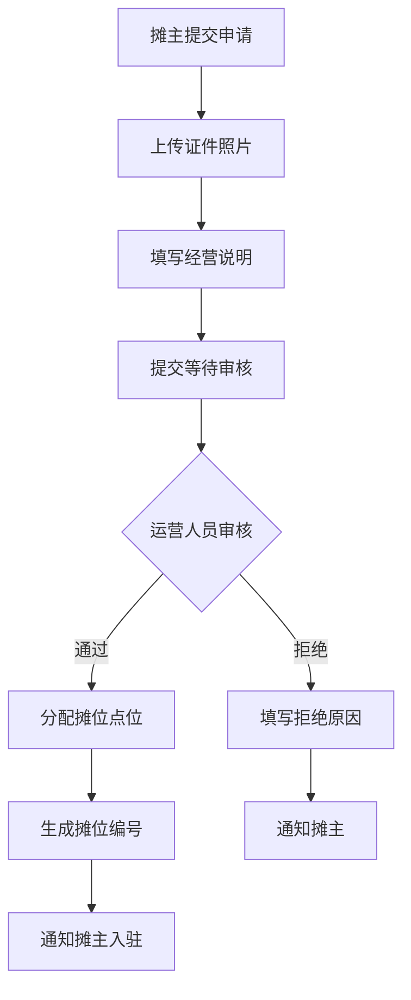
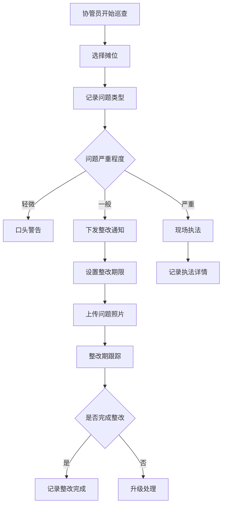

# 摆摊区域维护系统 - 产品需求文档

## 1. 产品概述

摆摊区域维护系统是一款面向城市管理人员的数字化工具，用于规范临时摆摊区域的管理。系统支持区域边界绘制、摊位信息维护、入驻申请审批、巡查问题记录和数据统计分析，提升城市管理效率和透明度。

目标用户：
- 城管协管员：负责日常巡查、问题记录和区域维护
- 街区运营人员：负责摊位审批、资源分配和数据分析

核心价值：
- 数字化管理替代传统纸质登记
- 实时掌握摊位分布和经营状态
- 规范化巡查流程和整改跟踪
- 数据驱动决策支持

## 2. 核心功能

### 2.1 用户角色

| 角色 | 描述 | 核心权限 |
|------|------|----------|
| 城管协管员 | 日常巡查人员 | 区域地图查看、巡查记录、问题上报 |
| 街区运营人员 | 区域管理人员 | 全功能访问、审批管理、数据统计 |

### 2.2 功能模块

摆摊区域维护系统包含以下核心模块：

1. **区域地图** - 交互式地图展示和管理摆摊区域边界
2. **摊位列表** - 摊位信息的增删改查和状态管理
3. **申请审核** - 入驻申请的提交、审批和点位分配
4. **巡查记录** - 巡查问题记录、整改期限管理和照片上传
5. **统计看板** - 数据可视化展示经营状况和问题分布

### 2.3 页面详情

| 页面名称 | 模块名称 | 功能描述 |
|----------|----------|----------|
| 区域地图 | 地图展示 | 显示所有摆摊区域，支持缩放和平移 |
| 区域地图 | 区域绘制 | 绘制、编辑、删除区域边界 |
| 区域地图 | 区域信息 | 显示区域内的摊位数量和基本信息 |
| 摊位列表 | 筛选搜索 | 按状态、区域、品类筛选摊位 |
| 摊位列表 | 摊位卡片 | 展示摊位编号、状态、经营时段、负责人 |
| 摊位列表 | 新增编辑 | 表单维护摊位详细信息 |
| 申请审核 | 申请列表 | 待审核、已通过、已拒绝分类展示 |
| 申请审核 | 申请详情 | 查看申请人信息、证件照片、经营说明 |
| 申请审核 | 审批操作 | 审核通过/拒绝，选择分配点位 |
| 巡查记录 | 巡查列表 | 按日期、区域筛选巡查记录 |
| 巡查记录 | 新增记录 | 选择摊位、记录问题类型、上传照片 |
| 巡查记录 | 整改管理 | 设置整改期限、跟踪整改进度 |
| 统计看板 | 概览卡片 | 空闲摊位数、违规次数、本月新增等 |
| 统计看板 | 热区分布 | 地图热力图展示摊位密度和违规分布 |
| 统计看板 | 到期提醒 | 即将到期摊位和许可证过期预警 |

## 3. 核心流程

### 3.1 摊位入驻流程

### 3.2 巡查问题处理流程

## 4. 用户界面设计

### 4.1 设计风格

**视觉定位**：现代政务风格 - 专业、高效、可信赖

**色彩系统**：
- 主色调：#1E3A5F（深海蓝）- 专业、权威
- 辅助色：#F8FAFC（浅灰白）- 背景、卡片
- 强调色：#F97316（活力橙）- 交互、重点
- 成功色：#10B981（翡翠绿）- 通过、正常
- 警告色：#EF4444（警示红）- 拒绝、违规
- 文字色：#1F2937（深灰）- 主要文字

**字体方案**：
- 标题：思源黑体 Bold / Noto Sans SC Bold
- 正文：思源黑体 Regular / Noto Sans SC Regular
- 数据：DIN Alternate / Roboto Mono

**布局风格**：
- 顶部导航 + 侧边栏布局
- 卡片式信息展示
- 数据可视化图表
- 响应式设计优先桌面端

**动效设计**：
- 页面切换：淡入淡出 200ms
- 卡片悬停：轻微上浮 + 阴影加深
- 数据加载：骨架屏 + 脉冲动画
- 成功反馈：绿色渐变闪烁

### 4.2 页面设计概述

**区域地图页面**
| 模块名称 | 视觉风格 | 布局说明 | 字体 | 动效 |
|----------|----------|----------|------|------|
| 地图容器 | 深色边框 | 全屏左侧70% | - | 缩放平滑过渡 |
| 区域列表 | 白色卡片 | 右侧固定300px | 正文14px | 悬停高亮 |
| 绘制工具栏 | 浮动工具条 | 地图左下角 | 图标+文字 | 激活状态缩放 |

**摊位列表页面**
| 模块名称 | 视觉风格 | 布局说明 | 字体 | 动效 |
|----------|----------|----------|------|------|
| 筛选栏 | 紧凑横条 | 顶部固定 | 标签12px | 输入框聚焦发光 |
| 摊位卡片 | 圆角卡片+阴影 | 网格布局3列 | 编号粗体 | 悬停上浮 |
| 状态标签 | 圆角胶囊 | 右上角 | 白色12px | 状态变更渐变 |
| 分页器 | 简洁分页 | 底部居中 | 正文14px | 页码切换滑动 |

**申请审核页面**
| 模块名称 | 视觉风格 | 布局说明 | 字体 | 动效 |
|----------|----------|----------|------|------|
| 状态标签页 | 下划线导航 | 顶部切换 | 当前态加粗 | 切换滑动下划线 |
| 申请卡片 | 左侧头像+右侧信息 | 双栏布局 | 信息分层显示 | 新申请闪烁边框 |
| 审批按钮 | 圆角按钮 | 卡片底部右对齐 | 白色粗体 | 点击波纹效果 |
| 模态框 | 居中卡片+遮罩 | 居中弹出 | 表单标签14px | 缩放淡入 |

**巡查记录页面**
| 模块名称 | 视觉风格 | 布局说明 | 字体 | 动效 |
|----------|----------|----------|------|------|
| 日期选择器 | 日历控件 | 左侧固定 | 当前日期高亮 | 日期切换淡入淡出 |
| 问题类型 | 图标+文字标签 | 横向排列 | 14px | 选中放大+变色 |
| 照片上传 | 网格预览+删除 | 3列网格 | 覆盖文字 | 拖拽上传区虚线动画 |
| 整改时间轴 | 垂直时间轴 | 右侧固定面板 | 日期节点粗体 | 节点依次出现 |

**统计看板页面**
| 模块名称 | 视觉风格 | 布局说明 | 字体 | 动效 |
|----------|----------|----------|------|------|
| 概览卡片 | 大数字+标签 | 4列等宽 | 数字粗体48px | 数字递增动画 |
| 热力图 | 渐变色覆盖 | 地图层叠 | - | 颜色渐变过渡 |
| 图表区 | 折线+柱状混合 | 自适应宽度 | 图例14px | 数据点悬停显示数值 |
| 到期提醒 | 列表+日期标签 | 红色警示边框 | 日期加粗 | 到期前闪烁 |

### 4.3 响应式设计

采用桌面优先设计，适配断点：
- 桌面端：≥1280px，完整侧边栏 + 多列布局
- 平板端：768px-1279px，收缩侧边栏 + 两列布局
- 移动端：<768px，底部导航 + 单列堆叠布局

## 5. 数据字段设计

### 5.1 区域数据

| 字段 | 类型 | 说明 |
|------|------|------|
| id | string | 区域唯一标识 |
| name | string | 区域名称 |
| boundary | GeoJSON | 区域边界坐标 |
| totalSpots | number | 总摊位数 |
| status | enum | active/inactive |

### 5.2 摊位数据

| 字段 | 类型 | 说明 |
|------|------|------|
| id | string | 摊位唯一标识 |
| number | string | 摊位编号 |
| areaId | string | 所属区域 |
| status | enum | vacant/occupied/maintenance |
| category | string[] | 允许经营品类 |
| businessHours | object | 经营时段 {start, end} |
| responsible | object | 负责人信息 |
| vendorId | string | 入驻摊主ID |
| expireDate | date | 到期日期 |

### 5.3 申请数据

| 字段 | 类型 | 说明 |
|------|------|------|
| id | string | 申请唯一标识 |
| vendorName | string | 申请人姓名 |
| vendorPhone | string | 联系电话 |
| idCard | string | 身份证号 |
| idCardPhoto | string[] | 证件照片URL |
| businessDesc | string | 经营说明 |
| category | string | 申请品类 |
| status | enum | pending/approved/rejected |
| assignedSpot | string | 分配摊位 |
| rejectReason | string | 拒绝原因 |
| createTime | datetime | 申请时间 |

### 5.4 巡查数据

| 字段 | 类型 | 说明 |
|------|------|------|
| id | string | 记录唯一标识 |
| spotId | string | 被巡查摊位 |
| inspector | string | 巡查人员 |
| issueType | enum | road_occupation/hygiene/noise/other |
| severity | enum | minor/moderate/severe |
| description | string | 问题描述 |
| photos | string[] | 问题照片 |
| rectDeadline | datetime | 整改期限 |
| rectStatus | enum | pending/completed/overdue |
| createTime | datetime | 巡查时间 |
