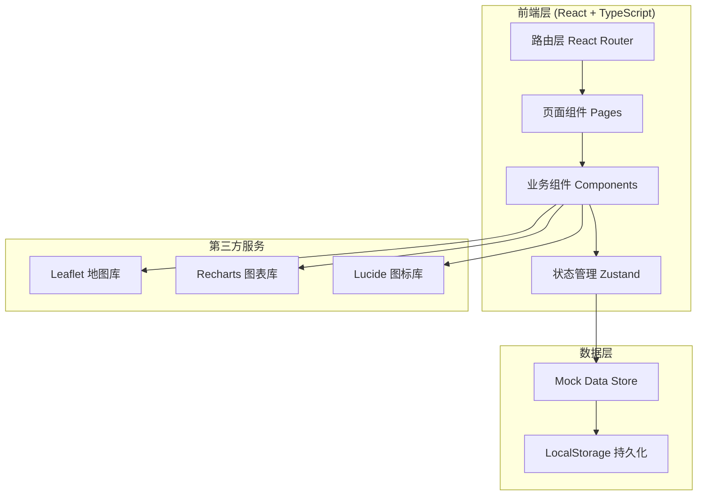
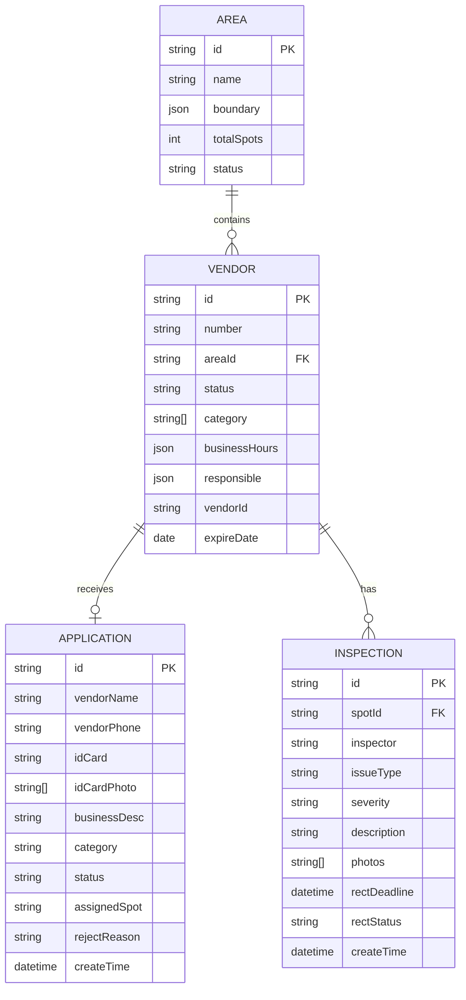

# 摆摊区域维护系统 - 技术架构文档

## 1. 架构设计

### 1.1 系统架构图



### 1.2 技术栈概览

| 层级 | 技术选型 | 版本要求 | 用途说明 |
|------|----------|----------|----------|
| 框架 | React | 18.x | UI 框架 |
| 语言 | TypeScript | 5.x | 类型安全 |
| 构建工具 | Vite | 5.x | 快速构建 |
| 样式 | Tailwind CSS | 3.x | 原子化CSS |
| 路由 | React Router | 6.x | 页面路由 |
| 状态 | Zustand | 4.x | 轻量状态管理 |
| 地图 | Leaflet + React-Leaflet | 4.x | 地图展示 |
| 图表 | Recharts | 2.x | 数据可视化 |
| 图标 | Lucide React | latest | 图标库 |

### 1.3 项目结构

```
src/
├── components/          # 可复用组件
│   ├── common/         # 通用组件（按钮、输入框、卡片等）
│   ├── map/            # 地图相关组件
│   ├── charts/         # 图表组件
│   └── layout/         # 布局组件
├── pages/              # 页面组件
│   ├── Map/            # 区域地图
│   ├── Vendors/        # 摊位列表
│   ├── Applications/   # 申请审核
│   ├── Inspections/    # 巡查记录
│   └── Dashboard/      # 统计看板
├── stores/             # Zustand 状态仓库
├── hooks/              # 自定义 Hooks
├── utils/              # 工具函数
├── types/              # TypeScript 类型定义
├── data/               # Mock 数据
├── App.tsx             # 应用入口
├── main.tsx            # 渲染入口
└── index.css           # 全局样式
```

## 2. 路由定义

| 路由路径 | 页面名称 | 组件位置 | 访问权限 |
|----------|----------|----------|----------|
| / | 首页/看板 | Dashboard | 全部用户 |
| /map | 区域地图 | Map | 全部用户 |
| /vendors | 摊位列表 | Vendors | 全部用户 |
| /applications | 申请审核 | Applications | 运营人员 |
| /inspections | 巡查记录 | Inspections | 协管员+运营人员 |
| /dashboard | 统计看板 | Dashboard | 全部用户 |

## 3. 数据模型

### 3.1 实体关系图



### 3.2 状态枚举定义

```typescript
// 摊位状态
type VendorStatus = 'vacant' | 'occupied' | 'maintenance';

// 申请状态
type ApplicationStatus = 'pending' | 'approved' | 'rejected';

// 问题类型
type IssueType = 'road_occupation' | 'hygiene' | 'noise' | 'other';

// 问题严重程度
type Severity = 'minor' | 'moderate' | 'severe';

// 整改状态
type RectStatus = 'pending' | 'completed' | 'overdue';
```

## 4. 状态管理设计

### 4.1 Zustand Store 结构

| Store 名称 | 状态内容 | 主要操作 |
|------------|----------|----------|
| useAreaStore | 区域列表、当前选中区域 | addArea, updateArea, deleteArea, setSelected |
| useVendorStore | 摊位列表、筛选条件 | addVendor, updateVendor, deleteVendor, setFilter |
| useApplicationStore | 申请列表、当前审批 | submitApplication, approve, reject, assignSpot |
| useInspectionStore | 巡查记录、整改跟踪 | addInspection, updateRectStatus |
| useUIStore | 侧边栏状态、模态框 | toggleSidebar, openModal, closeModal |

### 4.2 数据持久化

- 使用 LocalStorage 存储应用状态
- 关键数据（区域、摊位）自动同步到本地存储
- 页面刷新后恢复上次状态

## 5. 第三方库集成

### 5.1 Leaflet 地图集成

- 使用 react-leaflet 封装组件
- 支持绘制区域边界（Polygon）
- 支持摊位点位标记（Marker）
- 自定义地图样式和交互

### 5.2 Recharts 图表集成

- 折线图：统计趋势展示
- 柱状图：违规类型分布
- 饼图：摊位状态占比
- 地图热力图：摊位密度分布

## 6. Mock 数据设计

### 6.1 示例数据规模

| 数据类型 | 初始数据量 | 说明 |
|----------|------------|------|
| 区域 | 5个 | 不同街区摆摊区域 |
| 摊位 | 50个 | 分布在各区域内 |
| 申请 | 20条 | 包含各状态 |
| 巡查记录 | 100条 | 近3个月数据 |

### 6.2 数据生成策略

- 使用 Faker.js 或手动编写 Mock 数据
- 确保数据真实性（真实摊位编号格式、日期范围等）
- 数据关系一致（申请对应摊位ID等）

## 7. 性能优化

### 7.1 加载优化

- 路由懒加载（React.lazy + Suspense）
- 组件按需导入
- 图片懒加载

### 7.2 渲染优化

- React.memo 缓存组件
- useMemo 缓存计算结果
- useCallback 缓存回调函数

### 7.3 地图优化

- 地图瓦片懒加载
- 区域边界简化（Douglas-Peucker算法）
- 标记点聚合显示

## 8. 浏览器兼容性

| 浏览器 | 最低版本 | 说明 |
|--------|----------|------|
| Chrome | 90+ | 推荐 |
| Firefox | 88+ | 支持 |
| Safari | 14+ | 支持 |
| Edge | 90+ | 支持 |
| IE | 不支持 | - |

## 9. 辅助功能

- 语义化 HTML 标签
- ARIA 无障碍属性
- 键盘导航支持
- 焦点管理
- 颜色对比度符合 WCAG AA 标准
